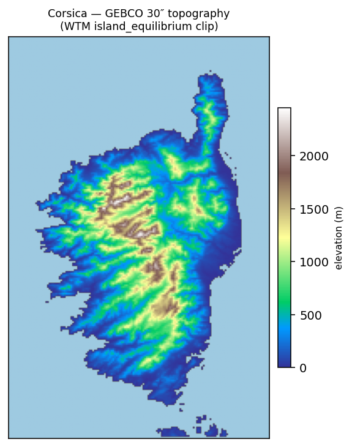
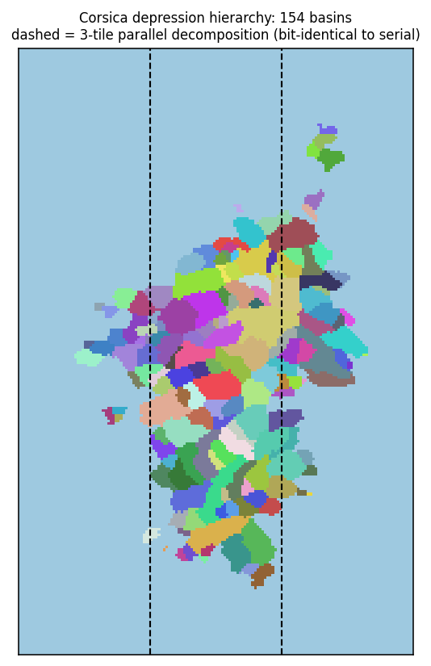

Depression Hierarchies
======================

**Title of Manuscript**:
 * Computing water flow through complex landscapes, Part 2: Finding hierarchies in depressions and morphological segmentations (doi: [10.5194/esurf-2019-34](https://doi.org/10.5194/esurf-2019-34))

**Previous Manuscripts**:
 * Computing water flow through complex landscapes – Part 1: Incorporating depressions in flow routing using FlowFill (doi: [10.5194/esurf-7-737-2019](https://doi.org/10.5194/esurf-7-737-2019))

**Subsequent Manuscripts**
 * Computing water flow through complex landscapes, Part 3: Fill-Spill-Merge: Flow routing in depression hierarchies (doi: [10.5194/esurf-9-105-2021](https://dx.doi.org/10.5194/esurf-9-105-2021))

**Authors**: Richard Barnes, Kerry Callaghan, Andrew Wickert

**Corresponding Author**: Richard Barnes (richard.barnes@berkeley.edu)

**Code Repositories**
 * [Author's GitHub Repository](https://github.com/r-barnes/Barnes2019-DepressionHierarchy)

This repository contains a reference implementation of the algorithms presented
in the manuscript above, along with information on acquiring the various
datasets used, and code to perform correctness tests.

Abstract
--------

Depressions – inwardly-draining regions of digital elevation models – present
difficulties for terrain analysis and hydrological modeling. Analogous
"depressions" also arise in image processing and morphological segmentation
where they may represent noise, features of interest, or both. Here we provide a
new data structure – the depression hierarchy – that captures the full topologic
and topographic complexity of depressions in a region. We treat depressions as
networks, in a way that is analogous to surface-water flow paths, in which
individual sub-depressions merge together to form meta-depressions in a process
that continues until they begin to drain externally. The hierarchy can be used
to selectively fill or breach depressions, or to accelerate dynamic models of
hydrological flow. Complete, well-commented, open-source code and correctness
tests are available on Github and Zenodo.

Prerequisites
-------------

Although GDAL is not required to use the library, it is needed to run the
example program.

Install the prerequisites

### Linux

    sudo apt install libgdal-dev cmake

### Mac

    brew install gdal libomp cmake

Compilation
-----------

Ensure you have a working compiler.

The following compilers are known to work: GCC7.5.0, GCC8.4.0, GCC9.3.0

The following compilers are known to be too old: GCC5.4.0

Next, be sure to acquire submodules either upon initially obtaining the repository:

    git clone --recurse-submodules -j8 https://github.com/r-barnes/Barnes2019-DepressionHierarchy.git

Or afterwards by using the following within the repository itself:

    git submodule update --init --recursive

Afterwards, compile:

    mkdir build
    cd build
    # -DUSE_GDAL is optional
    cmake -DCMAKE_BUILD_TYPE=Release -DUSE_GDAL=On ..
    make -j 4 #Set to number of CPUs for a faster compilation

Run with:

    ./build/dephier.exe <Input> <Output Prefix> <Ocean Level>

`<INPUT>` can be any file that GDAL can read.

`<Output Prefix>` is a name such as `temp/out` which is used to prefix the
following output files:

 * `temp/out-label.tif`: A file showing the depression hierarchy leaf label of each cell in the DEM
 * `temp/out-graph.csv`: A CSV file showing the topological relationships of the depression hierarchy's depressions

`<Ocean Level>` is the elevation of the ocean within the dataset All cells having this elevation are considered to be part of the ocean.

Distributed (parallel) build — worked example: Corsica
======================================================

This fork adds a **distributed-memory (MPI) DepressionHierarchy build** so the DH
can be computed for DEMs too large to hold on one node: the grid is tiled across
ranks, each rank holds only `O(N/P) + O(boundary)`, and the per-tile results are
stitched into one hierarchy. See `archive/PARALLEL_DEPHIER_PLAN.md` and `ENHANCEMENTS.md`.

The example below runs on **Corsica at GEBCO 30″** — the same clip the
[Water Table Model (WTM)](https://github.com/KCallaghan/WTM) uses for its island
example — so the depressions here are exactly the basins WTM's Fill-Spill-Merge
fills with lakes.

| | |
|:---:|:---:|
|  |  |
| **Input:** GEBCO 30″, 156×240, land floored to ≥0.5 m, flat ocean at 0. | **Output:** 154 closed depressions. Dashed lines = a 3-tile parallel decomposition. |

**Parallel vs. serial.** The distributed build is validated against the serial
`GetDepressionHierarchy` as the differential oracle. On this clip:

| build | depression tree | total depression volume | flat flowdirs |
|---|---|---|---|
| serial (1 tile) | 163 nodes (154 basins) | 4794 | — |
| distributed, 2 tiles | 164 nodes | **4794 (=serial)** | `flat_diff=0` |
| distributed, 3 tiles | **163 nodes (bit-identical)** | **4794 (=serial)** | `flat_diff=0` |
| distributed, 4 tiles | 165 nodes | **4794 (=serial)** | `flat_diff=0` |

Every tiling reproduces the serial build to the accepted bar — **correct depression
volumes and a valid hierarchy** — with the per-rank flat resolution bit-identical
to serial (`flat_diff=0`). The small tree-node differences at 2 and 4 tiles are the
`ocean_linked` nesting order at tied outlets (a documented tie-break class, volume-
preserving); the 3-tile decomposition is byte-for-byte identical.

How the build is validated at *every* scale — bit-identity against serial where serial
can run, and split-invariance where it can't — is written up in `VALIDATION.md`. The
footprint-vs-exactness run modes (default / uncapped replay / capped replay) and how to
choose among them are in `BENCHMARKS.md`.

**Reproduce:**

    python3 examples/corsica/make_corsica.py                 # regenerate corsica.tif from the WTM clip
    ./build/dephier.exe examples/corsica/corsica.tif out/corsica 0   # serial DH + -label.tif
    ./build/dephier_mpi.exe examples/corsica/corsica.tif 0 52,104    # distributed DH (3 tiles) vs serial

The figures are produced from `out/corsica-label.tif` (the per-cell depression
label the serial tool writes).
